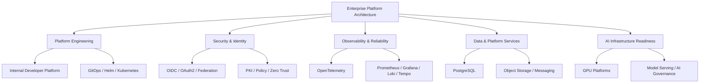
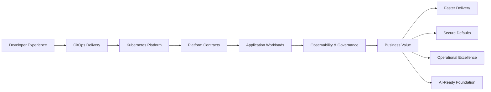
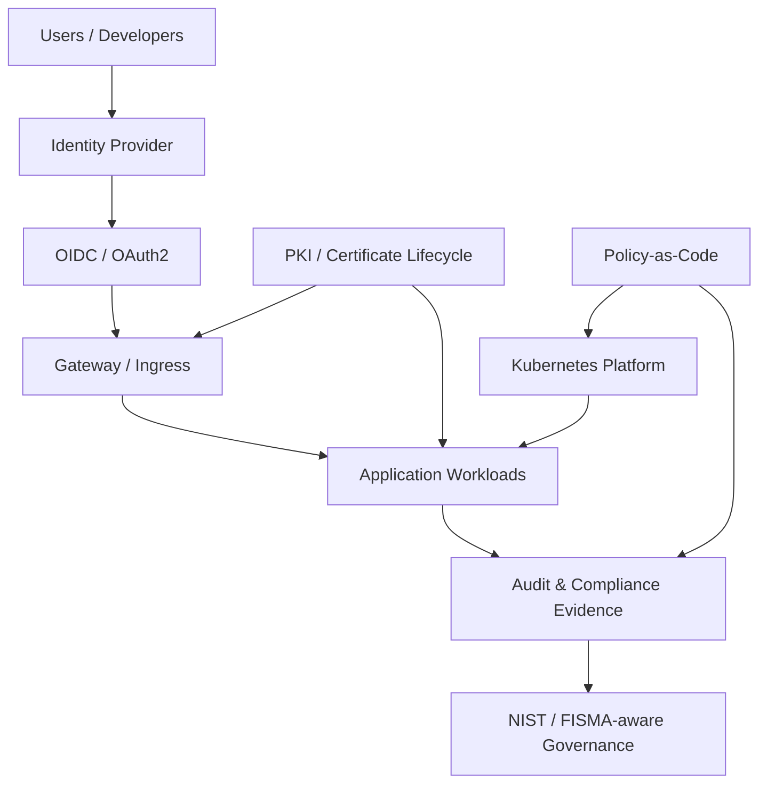
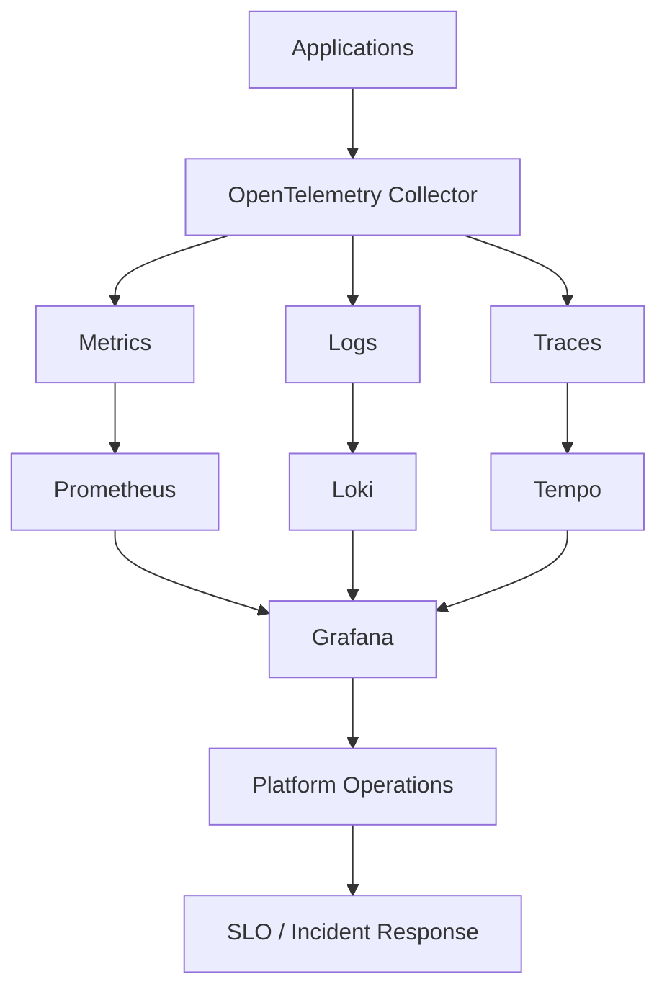
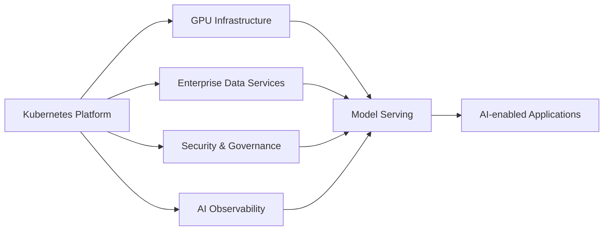

# Enterprise Platform Architecture Portfolio

**Platform Architect | Cloud Native Platforms | Kubernetes | Security & Identity | Observability | AI Infrastructure**

This repository presents a professional architecture portfolio for modern enterprise platforms.  
It combines architecture concepts, domain diagrams, and a lightweight demo layer to show how platform capabilities can be designed, packaged, secured, observed, and extended toward AI infrastructure.

> All content is generalized and does not include confidential company, customer, network, IP, or production environment details.

---

## Portfolio Navigation

| Domain | Description | Link |
|---|---|---|
| Platform Architecture | Overall platform model, layers, and business value | [docs/platform-architecture.md](docs/platform-architecture.md) |
| Platform Engineering | IDP, GitOps, Kubernetes, platform contracts | [docs/platform-engineering.md](docs/platform-engineering.md) |
| Security & Identity | OIDC, PKI, Zero Trust, policy, NIST-aware controls | [docs/security-identity.md](docs/security-identity.md) |
| Observability & Reliability | OpenTelemetry, Prometheus, Grafana, Loki, Tempo, SLOs | [docs/observability-reliability.md](docs/observability-reliability.md) |
| Data & Platform Services | PostgreSQL, object storage, messaging, data contracts | [docs/data-platform-services.md](docs/data-platform-services.md) |
| AI Infrastructure | GPU platforms, model serving, vector data, governance | [docs/ai-infrastructure.md](docs/ai-infrastructure.md) |
| Demo Layer | Lightweight deployable app and Helm packaging | [app/](app/) and [chart/](chart/) |

---

## 1. Enterprise Platform Capability Map



---

## 2. Platform Delivery Flow



---

## 3. Security & Identity Reference Model



---

## 4. Observability Reference Model



---

## 5. AI Infrastructure Extension



---

## What This Repository Demonstrates

| Capability | Evidence in Repo |
|---|---|
| Architecture Thinking | Domain docs, Mermaid diagrams, canvas diagrams |
| Platform Engineering | GitOps-ready structure, Kubernetes packaging, platform contracts |
| Security & Identity | Dedicated security model, OIDC/PKI/policy concepts |
| Observability | Dedicated observability architecture and metrics-enabled demo |
| Data Services | Platform contracts for database and object storage |
| AI Infrastructure | AI readiness architecture and extension model |
| Implementation Ability | Lightweight demo app, Dockerfile, Helm chart |

---

## Lightweight Demo Layer

The repo includes a small demo app to show how architecture concepts map to deployable components.

```bash
docker build -t platform-demo-app:1.0.0 ./app

helm upgrade --install platform-demo-app ./chart \
  --namespace platform-demo \
  --create-namespace
```

The demo is intentionally minimal. The primary purpose of this repository is to show **enterprise platform architecture capability**.

---
- AI Infrastructure Architect
- DevSecOps / Platform Security Architect
