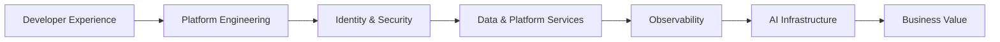

# Enterprise Platform Architecture Portfolio

**Platform Architect | Cloud Native Architect | AI Infrastructure Architect**

This repository showcases architecture patterns and platform capabilities used to build secure, observable, cloud-native enterprise platforms.

## Architecture Domains

### Platform Engineering
- Internal Developer Platforms
- Kubernetes
- GitOps
- Self-Service Delivery
- Platform Contracts

### Identity & Access
- OIDC
- OAuth2
- Federation
- Service Authentication

### Security & Compliance
- Zero Trust Principles
- PKI & Certificate Lifecycle
- Policy as Code
- NIST RMF Alignment
- Secure Supply Chain

### Observability & Reliability
- OpenTelemetry
- Prometheus
- Grafana
- Loki
- Tempo
- SLO-driven Operations

### Data Platforms
- PostgreSQL
- Object Storage
- Data Platform Services

### AI Infrastructure
- GPU Platforms
- Model Serving
- AI Governance
- Responsible AI Controls

## Architecture References

- docs/platform-architecture.md
- docs/platform-domains.md
- docs/ai-infrastructure-roadmap.md

## Repository Structure

```text
docs/
diagrams/
app/
chart/
platform/
```

## Architecture Vision


