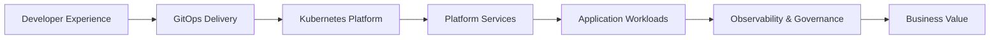

# Enterprise Platform Architecture Portfolio

A focused, architecture-driven portfolio showing how modern platform teams design reusable cloud-native capabilities for application delivery.

This repo keeps the implementation intentionally small. The goal is to show **platform architecture thinking** supported by a lightweight deployable demo layer.

---

## Architecture Focus

This portfolio demonstrates:

- Internal Developer Platform patterns
- Kubernetes platform engineering
- GitOps-ready delivery structure
- Platform service contracts
- Secure workload defaults
- Observability-ready application design
- AI infrastructure readiness

---

## Platform Flow



---

## Repository Structure

```text
.
├── README.md
├── docs/
│   └── architecture.md
├── app/
│   ├── main.py
│   ├── requirements.txt
│   └── Dockerfile
├── chart/
│   ├── Chart.yaml
│   ├── values.yaml
│   └── templates/
├── platform/
│   └── contracts.yaml
└── diagrams/
    ├── platform-flow.mmd
    └── platform-flow.canvas
```

---

## What The Demo Layer Shows

| Component | Purpose |
|---|---|
| Demo API | Shows a simple workload consuming platform context |
| Helm Chart | Shows deployable Kubernetes packaging |
| Platform Contracts | Shows identity, data, trust, and observability contracts |
| Metrics Endpoint | Shows observability readiness |
| Security Defaults | Shows non-root, least-privilege workload posture |

---

## Business Value

This architecture supports:

- Faster application onboarding
- Reduced developer cognitive load
- Standardized platform services
- Secure-by-default delivery
- Better operational visibility
- Easier governance and audit readiness
- A foundation for future AI workloads

---

## Deploy Demo

Build the image and install the Helm chart into a Kubernetes environment of your choice.

```bash
docker build -t platform-demo-app:1.0.0 ./app

helm upgrade --install platform-demo-app ./chart \
  --namespace platform-demo \
  --create-namespace
```

Validate the deployment:

```bash
kubectl -n platform-demo get deploy,svc,pod
```

---

## Portfolio Positioning

This repo is designed to support Platform Architect, Principal Platform Engineer, Cloud Native Architect, and AI Infrastructure Architect positioning.
