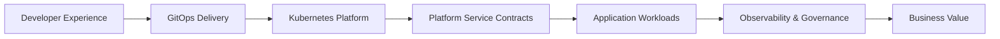

# Enterprise Platform Architecture Portfolio

A compact architecture-driven portfolio showing how reusable cloud-native platform capabilities can support application delivery, governance, observability, and future AI workloads.

The repo is intentionally small, but it still demonstrates the key platform architecture concepts expected from a **Platform Architect / Principal Platform Engineer** profile.

---

## What This Portfolio Shows

| Domain | Architecture Concept | Example in Repo |
|---|---|---|
| Developer Experience | Self-service, golden paths, lower cognitive load | Platform flow and demo app contract |
| GitOps Delivery | Declarative deployment and reusable packaging | Helm chart |
| Kubernetes Platform | Secure workload runtime and service networking | Deployment, Service, NetworkPolicy |
| Platform Services | Identity, data, trust, observability contracts | `platform/contracts.yaml` |
| Security & Governance | Secure defaults, ownership, audit-friendly design | Architecture docs and workload settings |
| Observability | Metrics, readiness, operational visibility | `/metrics`, `/health`, `/ready` |
| AI Readiness | Platform foundation for AI workloads | AI-readiness notes in architecture |

---

## Architecture Flow



---

## Repo Structure

```text
.
├── README.md
├── docs/
│   ├── architecture.md
│   ├── platform-contracts.md
│   └── security-governance-ai.md
├── app/
│   ├── main.py
│   ├── requirements.txt
│   └── Dockerfile
├── chart/
│   ├── Chart.yaml
│   ├── values.yaml
│   └── templates/
├── platform/
│   └── contracts.yaml
└── diagrams/
    ├── platform-flow.mmd
    └── platform-flow.canvas
```

---

## Why This Is Architect-Level

This is not just a demo app. It shows how platform teams think in reusable layers:

```text
Developer need
   ↓
Platform pattern
   ↓
Reusable contract
   ↓
Secure runtime
   ↓
Observable workload
   ↓
Business outcome
```

---

## Deployable Demo Layer

The demo app is intentionally lightweight. It exists to prove that the architecture can be packaged and deployed.

```bash
docker build -t platform-demo-app:1.0.0 ./app

helm upgrade --install platform-demo-app ./chart \
  --namespace platform-demo \
  --create-namespace
```

Validate:

```bash
kubectl -n platform-demo get deploy,svc,pod
```

---

## Business Value Delivered

- Faster application onboarding
- Reduced developer cognitive load
- Standardized identity, data, trust, and observability contracts
- Secure-by-default workload patterns
- Better operational readiness
- Governance-ready platform structure
- Foundation for AI infrastructure and model-serving workloads
