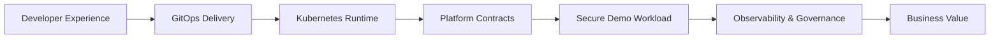
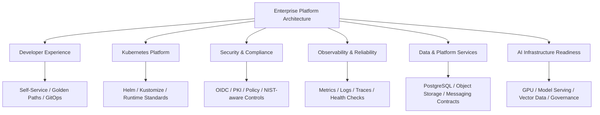

# Enterprise Platform Architecture Portfolio

**Architecture-first portfolio with a deployable cloud-native demo layer.**

This repository demonstrates how a modern enterprise platform can be designed, packaged, governed, and deployed using cloud-native engineering practices.

It is intentionally structured as a **Platform Architect portfolio**, not just an application repo.

---

## Executive Summary

This portfolio shows how reusable platform capabilities can help organizations deliver applications faster, more securely, and more consistently.

It demonstrates:

- Internal Developer Platform design
- Kubernetes platform engineering
- GitOps-ready delivery structure
- Secure-by-default application patterns
- Observability and reliability standards
- Platform service contracts
- Compliance-aware governance
- AI infrastructure readiness

> All examples are generalized and do not include confidential company, customer, network, or production details.

---

## Visual Architecture

### Platform capability flow



### Platform domains



---

## What Is Deployable?

The repo includes a small demo API service that proves the architecture can be deployed.

| Layer | Implementation |
|---|---|
| Demo App | FastAPI service |
| Container | Dockerfile |
| Packaging | Helm chart |
| Platform Contracts | Kustomize ConfigMaps/Secrets |
| Runtime Controls | Namespace, quota, limits, NetworkPolicy |
| Reliability | Readiness/liveness probes, HPA, PDB |
| Observability | `/metrics`, `/health`, `/ready`, structured logging |
| CI | GitHub Actions for tests, Helm render, Kustomize build |

---

## Repository Map

```text
.
├── app/                         # Deployable demo API service
├── charts/platform-demo-app/     # Production-style Helm chart
├── environments/                 # Kustomize and Helm values
├── platform/                     # Platform contracts, controls, namespaces
├── docs/                         # Architecture, ADRs, runbooks
├── diagrams/                     # Mermaid and Canvas diagrams
├── scripts/                      # Build, deploy, validate helpers
└── .github/workflows/            # CI validation
```

---

## Start Here

| Goal | File |
|---|---|
| Understand the architecture | [Architecture Overview](docs/architecture/01-architecture-overview.md) |
| See production-readiness decisions | [Production Readiness](docs/architecture/02-production-readiness.md) |
| Understand platform contracts | [Platform Contracts](docs/architecture/03-platform-contracts.md) |
| Understand AI-readiness direction | [AI Infrastructure Readiness](docs/architecture/04-ai-readiness.md) |
| Deploy and validate | [Operations Runbook](docs/operations/runbook.md) |
| View decisions | [Architecture Decision Records](docs/adr/) |

---

## Quick Deploy

### 1. Run locally

```bash
cd app
python -m venv .venv
source .venv/bin/activate
pip install -r requirements.txt
uvicorn platform_demo.main:app --host 0.0.0.0 --port 8080
```

### 2. Build image

```bash
./scripts/build-image.sh
```

### 3. Deploy platform contracts

```bash
kubectl apply -k environments/local
```

### 4. Deploy demo workload

```bash
helm upgrade --install platform-demo-app ./charts/platform-demo-app \
  --namespace platform-demo \
  --create-namespace \
  -f environments/prod-like/values.yaml
```

### 5. Validate

```bash
./scripts/validate-deployment.sh platform-demo
kubectl -n platform-demo port-forward svc/platform-demo-app 8080:80
```

Open:

```text
http://localhost:8080
http://localhost:8080/health
http://localhost:8080/ready
http://localhost:8080/platform-contract
http://localhost:8080/architecture
http://localhost:8080/metrics
```

---

## Why This Portfolio Matters

This repo demonstrates a Platform Architect mindset:

- Define the architecture first
- Standardize reusable contracts
- Package workloads consistently
- Apply secure defaults
- Make systems observable
- Keep deployments GitOps-ready
- Build with future AI workloads in mind

It shows both **architecture thinking** and **working implementation**.
