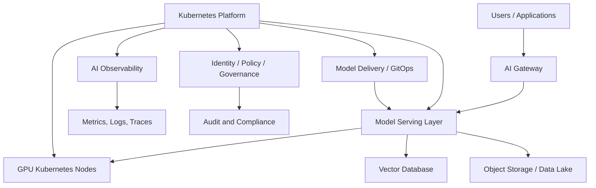

# Enterprise AI Infrastructure Platform

## Overview

This reference architecture shows how an enterprise platform can evolve to support AI workloads, model serving, GPU infrastructure, observability, data access, and governance.

The goal is to position Kubernetes and cloud-native platforms as the foundation for both traditional application workloads and AI-enabled workloads.

---

## Core Components

- Kubernetes for AI workloads
- GPU-enabled worker nodes
- NVIDIA GPU Operator
- Model serving layer
- Vector database
- Object storage / data lake
- Feature and data pipelines
- AI observability and tracing
- Identity and access control
- AI governance and auditability
- Cost and capacity management

---

## Architecture Flow

---

## AI Platform Design Considerations

### 1. GPU Scheduling and Utilization

AI workloads require careful planning around GPU capacity, scheduling, isolation, and cost control.

### 2. Model Serving Scalability

The platform should support scalable and observable model serving patterns with clear routing, authentication, and versioning.

### 3. Data Privacy and Access Control

AI workloads often require access to sensitive enterprise data. Access must be governed through identity, policy, and audit controls.

### 4. AI Workload Observability

AI platforms need visibility across infrastructure metrics, application logs, traces, model latency, inference errors, and capacity usage.

### 5. Cost Management

GPU workloads can become expensive quickly. Platform teams should provide cost visibility and workload placement guidance.

### 6. Governance and Compliance

AI infrastructure should support model lineage, access control, audit logs, responsible AI practices, and regulatory requirements.

---

## Target Use Cases

- Enterprise AI assistants
- Retrieval-Augmented Generation
- Model serving platforms
- AI-enabled business workflows
- MLOps and AI platform operations
- AI observability and platform governance

---

## Platform Architect Perspective

The AI infrastructure architect should not only understand models. The architect should understand how models run securely, reliably, and efficiently on enterprise platforms.

Key platform questions:

- Where do AI workloads run?
- How are models deployed and versioned?
- How is GPU capacity managed?
- How is sensitive data protected?
- How are logs, metrics, and traces collected?
- How are AI systems governed and audited?
