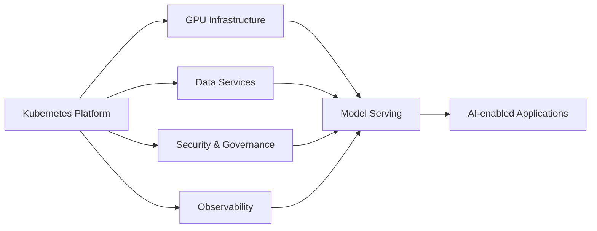

# AI Infrastructure Readiness

## Focus Areas

- GPU infrastructure
- Kubernetes AI workloads
- Model serving
- Vector databases
- AI observability
- AI governance
- Data access controls
- Responsible AI controls

## AI Platform Extension Model

## Value Delivered

- Future-ready platform strategy
- AI workload hosting foundation
- Governed access to enterprise data
- Observable AI services
- Foundation for model serving and MLOps
