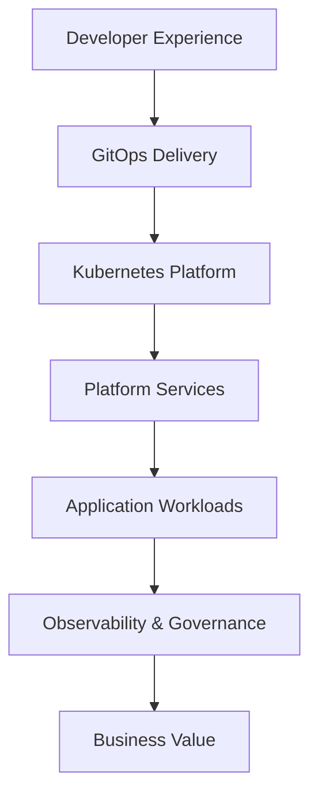

# Platform Architecture

## Overview

This architecture represents a compact Internal Developer Platform pattern.

The platform provides reusable capabilities so application teams can deploy workloads without rebuilding common concerns such as identity, data access, observability, trust, and security.

---

## Layered Architecture

| Layer | Purpose | Platform Architect Concern |
|---|---|---|
| Developer Experience | Make delivery easier for teams | Self-service, golden paths, clear ownership |
| GitOps Delivery | Make changes traceable and repeatable | Declarative configuration and deployment standards |
| Kubernetes Platform | Provide reliable workload runtime | Isolation, scheduling, service networking, scaling |
| Platform Services | Provide reusable dependencies | Identity, trust, data, observability |
| Governance | Make the platform auditable and secure | Policy, ownership, controls, evidence |
| Business Value | Connect platform work to outcomes | Speed, standardization, security, reliability |

---

## Reference Flow

---

## Core Architecture Principles

### 1. Platform as a Product

The platform should be treated as a product consumed by application teams, with reusable patterns, documentation, and a clear service model.

### 2. Golden Paths

Common application patterns should be standardized so teams can onboard quickly without custom infrastructure work every time.

### 3. Secure Defaults

The default deployment path should include security settings, health checks, resource controls, and network boundaries.

### 4. Observable by Design

Applications should expose health, readiness, and metrics endpoints by default.

### 5. Contracts Over One-Off Configuration

Identity, database, object storage, trust, and observability should be exposed as platform contracts.

### 6. AI-Ready Foundation

The same platform foundation can be extended for AI workloads with GPU scheduling, model serving, vector databases, and governance.
