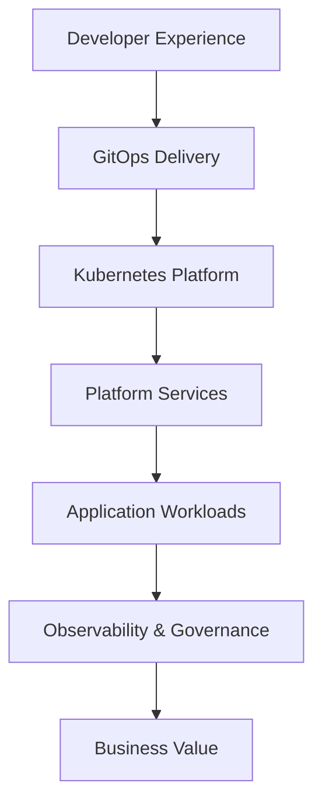

# Enterprise Platform Architecture

## Overview

This architecture represents a simplified Internal Developer Platform pattern for enterprise cloud-native environments.

The platform provides reusable services and guardrails so application teams can deploy workloads consistently without rebuilding identity, observability, data access, security, and deployment patterns from scratch.

---

## Layered Architecture

| Layer | Responsibility |
|---|---|
| Developer Experience | Self-service workflows, templates, golden paths |
| GitOps Delivery | Declarative configuration, Helm packaging, automated deployment |
| Kubernetes Platform | Runtime, scaling, service networking, workload isolation |
| Platform Services | Identity, data services, trust, observability, policy |
| Application Workloads | Business apps, APIs, services, data platforms, AI workloads |
| Governance | Security controls, auditability, standardization, reliability |

---

## Reference Flow

---

## Platform Services

The platform services layer provides reusable capabilities:

| Domain | Example Capabilities |
|---|---|
| Identity | OIDC, OAuth2, Keycloak-style identity integration |
| Trust | Certificates, CA bundles, PKI, trust distribution |
| Data | PostgreSQL, object storage, messaging contracts |
| Observability | Metrics, logs, traces, dashboards, alerts |
| Security | Network policy, pod security, secret handling, image scanning |
| Governance | Quotas, ownership, standard controls, audit evidence |

---

## Demo Layer

The demo application is intentionally small. It exists only to prove the architecture can be packaged and deployed.

It exposes:

- `/health`
- `/ready`
- `/platform-contract`
- `/metrics`

The app reads platform context from environment variables provided by the Helm chart.

---

## Production Considerations

A production version of this platform would add:

- GitOps controller integration
- External secrets management
- Certificate automation
- Real identity provider integration
- Real database and object storage services
- Policy-as-code enforcement
- Central observability stack
- Progressive delivery
- AI infrastructure extensions such as GPU node pools and model-serving platforms
