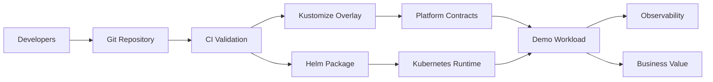

# Architecture Overview

## Purpose

This architecture demonstrates how a modern platform team can package reusable capabilities for application teams.

The deployable demo is small, but the structure around it represents a realistic platform operating model.

---

## Architecture Layers

| Layer | Purpose |
|---|---|
| Developer Experience | Self-service, templates, golden paths, GitOps workflows |
| Delivery Layer | CI validation, Helm packaging, Kustomize overlays |
| Kubernetes Runtime | Secure workload execution, scaling, networking, reliability |
| Platform Contracts | Identity, database, storage, trust, observability |
| Governance | Resource controls, policy examples, audit-friendly structure |
| Business Value | Faster delivery, standardization, secure defaults, operational readiness |

---

## Flow

---

## Architecture Principles

### 1. Architecture-first

The repo leads with architecture documents and decision records before implementation details.

### 2. Secure-by-default

Workloads run with non-root settings, dropped capabilities, read-only filesystem, and namespace guardrails.

### 3. GitOps-ready

The repo uses declarative Kubernetes manifests, Helm, and Kustomize overlays.

### 4. Platform contracts

Application dependencies are modeled as reusable contracts instead of one-off configuration.

### 5. Observable by design

The app exposes health, readiness, and Prometheus metrics endpoints.

### 6. Future-ready

The structure can be extended to support AI workloads, GPU platforms, model serving, and governance.
