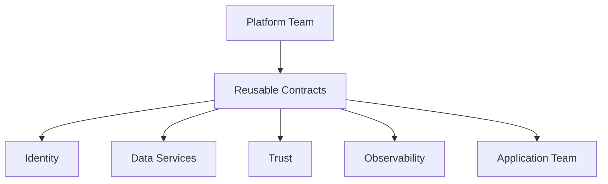

# Platform Contracts

Platform contracts define what the platform provides and what application teams can safely consume.

## Contracts Included

| Contract | Purpose |
|---|---|
| `tenant-info` | Tenant, environment, region, and ownership metadata |
| `postgres-connection` | Database connectivity contract |
| `s3-config` | Object storage configuration |
| `s3-credentials` | Object storage credential placeholder |
| `oidc-config` | Identity provider integration |
| `trust-bundle` | CA/trust distribution placeholder |
| `observability-config` | OpenTelemetry and metrics configuration |

## Why This Matters

Without platform contracts, each application team solves identity, storage, observability, trust, and database integration differently.

Platform contracts create:

- Standard onboarding
- Cleaner ownership boundaries
- Easier troubleshooting
- Better compliance alignment
- Repeatable deployment patterns
- Reduced developer cognitive load

## Contract Flow

