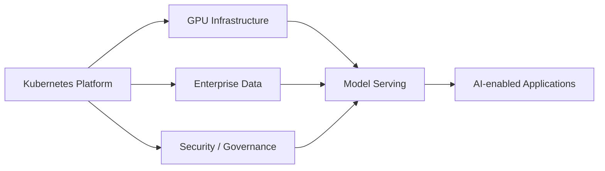

# AI Infrastructure Readiness

This repo does not deploy GPU workloads. Instead, it shows how an enterprise platform can be extended toward AI infrastructure.

## AI Extension Points

| Area | Future Capability |
|---|---|
| Compute | GPU-enabled Kubernetes node pools |
| Scheduling | GPU scheduling and isolation |
| Serving | Model-serving layer such as KServe |
| Data | Vector database and object storage |
| Observability | AI workload metrics, traces, latency, errors |
| Governance | Access control, model auditability, responsible AI controls |

## Platform Relevance

AI platforms still need the same foundations as traditional enterprise platforms:

- Identity
- Network controls
- Data access
- Observability
- Cost governance
- Security controls
- Deployment automation
- Audit evidence

## AI-Ready Flow

