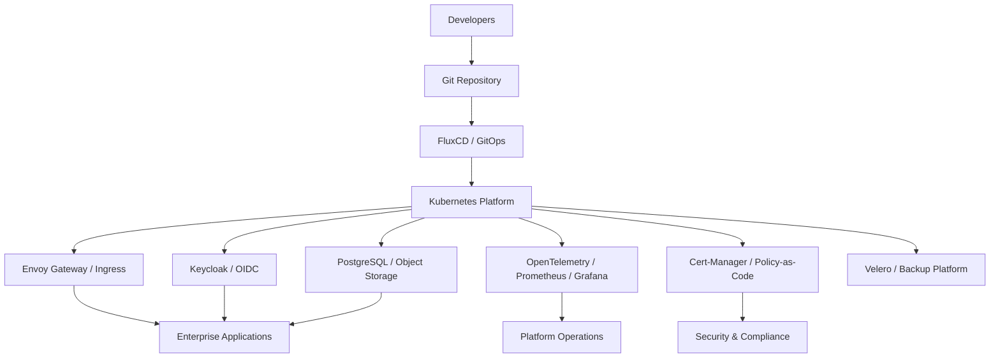

# Cloud Native Platform Reference Architecture

## Overview

This reference architecture describes a modern cloud-native platform designed to support enterprise application delivery using Kubernetes, GitOps, identity integration, observability, security, and platform automation.

The architecture is intended for organizations building shared platform capabilities for application teams, with a focus on reliability, standardization, security, and developer productivity.

---

## Core Components

- Kubernetes / OpenShift / Rancher
- FluxCD / GitOps
- Helm-based platform packaging
- Envoy Gateway / Ingress Gateway
- Cert-Manager / PKI
- Keycloak / OIDC
- Prometheus / Grafana / Loki / Tempo
- OpenTelemetry Collector
- PostgreSQL / Object Storage
- Policy-as-Code
- Backup and Recovery

---

## Architecture Flow

---

## Key Design Goals

- Reduce developer cognitive load
- Standardize deployment patterns
- Improve platform reliability
- Support secure multi-tenant workloads
- Enable faster application onboarding
- Provide full observability across logs, metrics, and traces
- Build repeatable platform services instead of one-off implementations

---

## Platform Architect Considerations

### 1. Tenant Isolation

The platform should provide namespace, network, identity, and resource isolation for different teams or tenants.

### 2. GitOps Operating Model

All platform and application changes should be managed through version-controlled repositories and automated reconciliation.

### 3. Secrets and Certificate Lifecycle

Certificates, trust bundles, and secrets should be managed consistently across namespaces and applications.

### 4. Ingress and Identity Strategy

Ingress, authentication, authorization, and policy enforcement should be standardized through platform-level services.

### 5. Data Service Dependencies

Application teams should consume approved data services such as PostgreSQL, object storage, and messaging through standard patterns.

### 6. Backup and Recovery

The platform should provide disaster recovery capabilities for Kubernetes resources, persistent volumes, and critical configuration.

### 7. Compliance and Auditability

Platform controls should support audit readiness, access governance, and security baselines aligned with enterprise compliance needs.

---

## Business Value

- Faster delivery of application environments
- Reduced operational inconsistency
- Improved reliability and incident response
- Stronger platform governance
- Better developer experience
- Improved readiness for AI and data-intensive workloads
