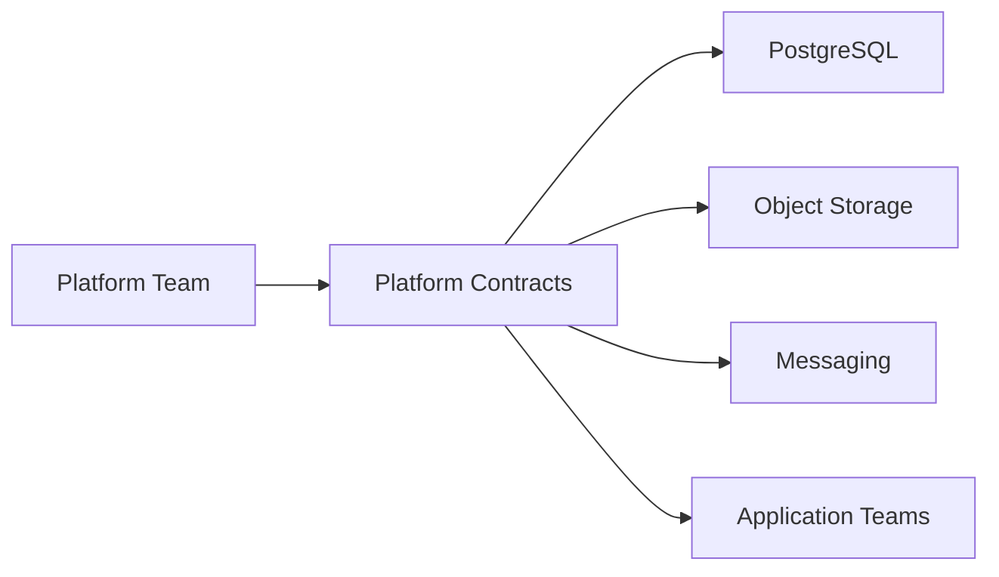

# Data & Platform Services

## Focus Areas

- PostgreSQL platform services
- CloudNativePG-style database operations
- Object storage
- S3-compatible storage contracts
- Messaging and event-driven services
- Platform service dependency contracts
- Data platform readiness

## Service Contract Model

## Value Delivered

- Standardized app dependencies
- Clear ownership boundaries
- Easier tenant onboarding
- Better operational support
- Reduced one-off configuration
