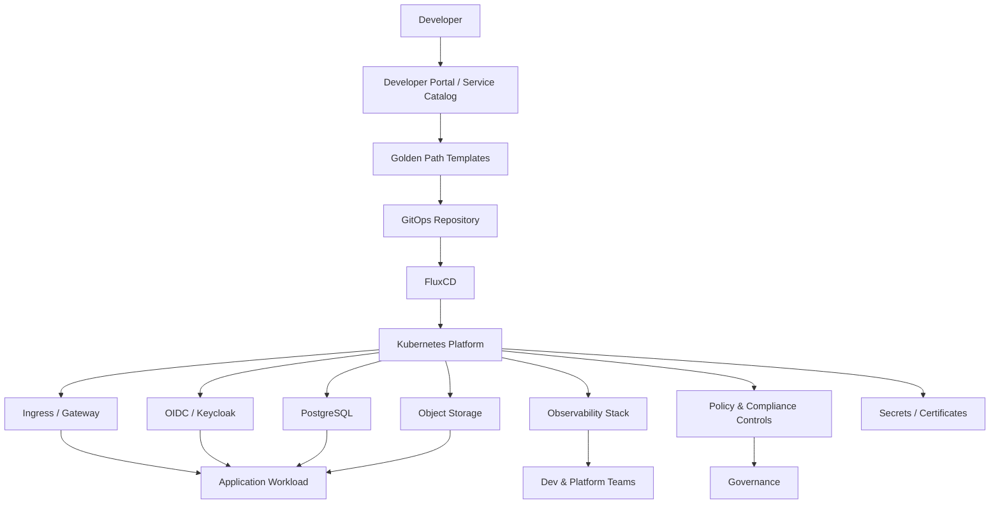

# Internal Developer Platform Architecture

## Overview

This architecture describes an Internal Developer Platform designed to provide reusable platform capabilities, golden paths, and self-service workflows for application teams.

The goal of an IDP is not to hide infrastructure completely. The goal is to provide developers with safe, standardized, and automated paths for deploying applications without requiring every team to become experts in Kubernetes, identity, networking, security, and observability.

---

## Platform Capabilities

- Application onboarding
- Namespace and tenant provisioning
- GitOps-based deployment
- Standardized ingress
- OIDC authentication
- Database provisioning
- Object storage access
- Observability dashboards
- Security policy enforcement
- Secrets and certificate management
- Backup and recovery patterns

---

## Architecture Flow



---

## Design Principles

### Platform as a Product

The platform should be treated like a product with users, feedback loops, documentation, adoption metrics, and continuous improvement.

### Self-Service Over Ticket-Driven Operations

Developers should be able to request common platform capabilities through templates, APIs, or service catalogs.

### Secure Defaults

The default path should include authentication, authorization, monitoring, logging, security scanning, and backup patterns.

### Golden Paths

Common workload patterns should be codified and made easy to consume.

Examples:

- Web API deployment
- Worker service deployment
- Database-backed application
- Event-driven application
- AI-enabled service
- Batch processing workload

### Clear Ownership

Platform teams own reusable capabilities. Application teams own business logic and workload configuration.

---

## Example Developer Workflow

```text
Developer selects application template
        ↓
Template creates GitOps repository structure
        ↓
Pipeline validates manifests and security policies
        ↓
FluxCD deploys workload to Kubernetes
        ↓
Platform services provide ingress, identity, secrets, observability, and data access
        ↓
Developer monitors application through standard dashboards
```

---

## Business Value

- Faster application onboarding
- Reduced deployment errors
- Better governance
- Improved developer experience
- Stronger operational consistency
- Clearer separation between platform and application responsibilities
