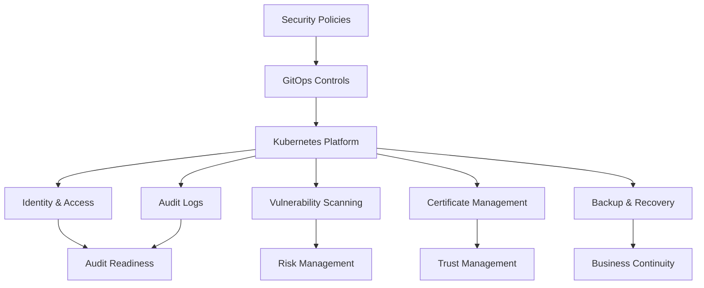

# NIST-Aligned Platform Governance

## Overview

This document describes how cloud-native platform architecture can align with NIST RMF, NIST 800-53, FISMA-oriented practices, and enterprise risk management expectations.

This is not a compliance checklist. It is a platform architecture view of how security, governance, and risk management can be embedded into reusable platform capabilities.

---

## Governance Objectives

- Standardize security controls across platform services
- Improve audit readiness
- Reduce manual compliance effort
- Provide traceability across identity, access, deployment, and operational events
- Support secure-by-default application onboarding
- Enable continuous monitoring

---

## Platform Capabilities Mapped to Governance Needs

| Platform Capability | Governance Value |
|---|---|
| Identity and Access Management | Supports access control, accountability, and least privilege |
| GitOps | Provides change traceability and deployment audit history |
| Policy-as-Code | Enforces security and configuration standards |
| Observability | Enables continuous monitoring and incident response |
| Certificate Management | Supports secure communication and trust lifecycle |
| Secrets Management | Reduces exposure of sensitive credentials |
| Backup and Recovery | Supports resilience and contingency planning |
| Vulnerability Scanning | Supports risk identification and remediation |
| Logging and Retention | Supports investigations and audit requirements |

---

## Architecture Flow



---

## NIST-Aligned Design Themes

### Access Control

Use centralized identity, RBAC, OIDC, and least-privilege access patterns.

### Configuration Management

Use GitOps, version control, policy-as-code, and automated validation to manage configuration drift.

### Audit and Accountability

Capture deployment events, access events, authentication events, and platform operational logs.

### System and Communications Protection

Use TLS, certificate lifecycle automation, secure ingress, and trusted service communication.

### Continuous Monitoring

Use logs, metrics, traces, vulnerability scanning, and alerting to monitor risk and platform health.

### Contingency Planning

Use backup, restore, disaster recovery, and platform resilience patterns.

---

## Platform Architect Perspective

A strong platform architecture should make compliance easier by embedding controls into the platform rather than forcing every application team to implement controls independently.

The best platform governance model is:

```text
Reusable Controls
        ↓
Automated Enforcement
        ↓
Continuous Monitoring
        ↓
Audit Evidence
        ↓
Reduced Risk
```
