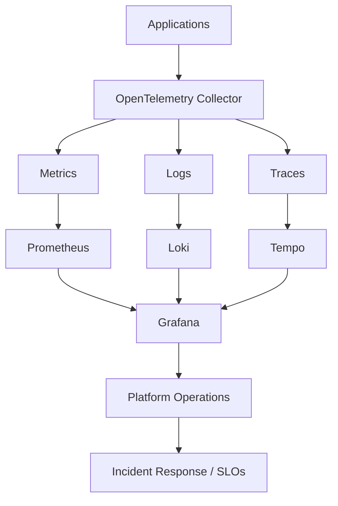

# Observability & Reliability Architecture

## Focus Areas

- OpenTelemetry
- Metrics, logs, and traces
- Prometheus
- Grafana
- Loki
- Tempo
- SLO / SLI thinking
- Incident response
- Platform reliability engineering

## Reference Model

## Value Delivered

- Faster troubleshooting
- Better service visibility
- Improved reliability
- Stronger incident response
- Unified platform telemetry
