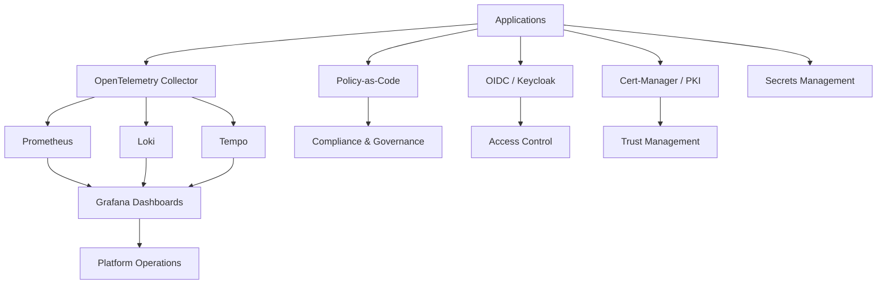

# Observability and Security Platform Architecture

## Overview

This architecture describes an integrated observability and security model for cloud-native platforms using OpenTelemetry, Prometheus, Grafana, Loki, Tempo, identity integration, and certificate lifecycle management.

The goal is to create a platform where application teams get consistent visibility, secure access patterns, and operational readiness by default.

---

## Observability Stack

- OpenTelemetry Collector
- Prometheus
- Grafana
- Loki
- Tempo
- Alertmanager
- PagerDuty / Incident Management
- Synthetic monitoring
- Service-level indicators and objectives

---

## Security Stack

- OIDC / OAuth2
- Keycloak
- Cert-Manager
- PKI and trust bundles
- Policy-as-Code
- Container scanning
- SAST / DAST
- Secrets management
- Runtime security controls
- Compliance reporting

---

## Architecture Flow

---

## Key Outcomes

- Unified visibility across logs, metrics, and traces
- Faster troubleshooting
- Improved incident response
- Secure workload identity
- Stronger audit readiness
- Better compliance alignment
- Reduced operational blind spots

---

## Platform Reliability Considerations

### Logs

Logs should provide meaningful application and platform events that help troubleshoot issues without exposing sensitive information.

### Metrics

Metrics should support capacity planning, service health, alerting, and platform performance management.

### Traces

Distributed tracing should help teams understand service-to-service dependencies, latency, and failure paths.

### Alerts

Alerts should be tied to user impact, service-level objectives, or platform health indicators.

### Dashboards

Dashboards should be standardized and focused on operational decisions, not just raw telemetry.

---

## Security and Compliance Considerations

- Authentication should be centralized where possible.
- Authorization should be explicit and auditable.
- Certificates should be automatically issued and rotated.
- Secrets should not be hardcoded in workloads.
- Policy controls should be enforced consistently.
- Audit logs should be retained according to compliance needs.
