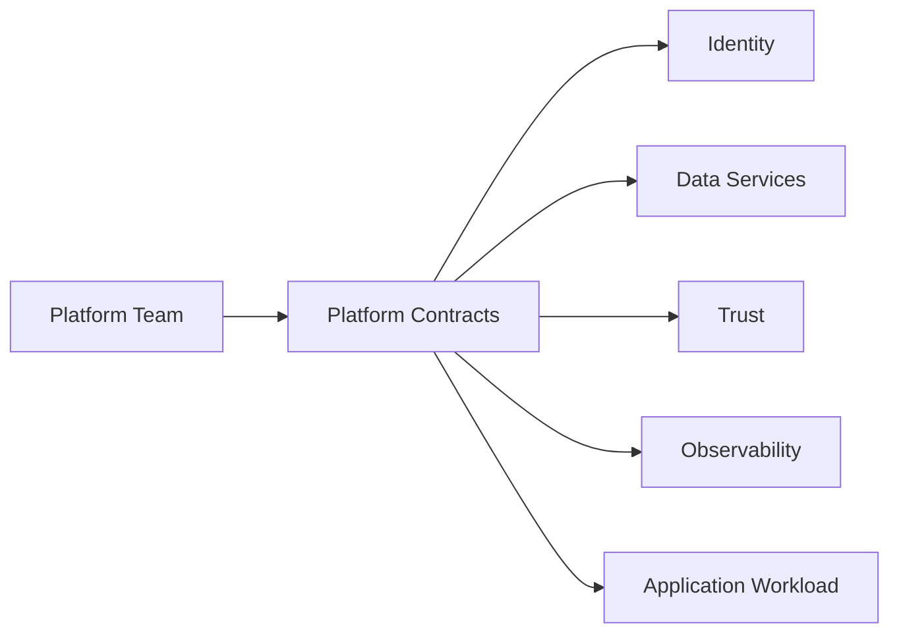

# Platform Contracts

## Purpose

Platform contracts define the interface between the platform team and application teams.

They answer a simple question:

> What reusable capabilities does the platform provide so every application team does not need to solve the same problem differently?

---

## Contracts in This Repo

| Contract | Purpose |
|---|---|
| Tenant Metadata | Defines tenant, environment, region, and ownership |
| Identity | Defines OIDC/OAuth issuer and authentication boundary |
| Data | Defines PostgreSQL and object storage endpoints |
| Trust | Defines certificate/trust distribution responsibility |
| Observability | Defines metrics and telemetry expectations |

---

## Contract Flow

---

## Why Contracts Matter

Without platform contracts, each team creates its own approach to:

- Identity
- Secrets
- Certificates
- Database connectivity
- Object storage
- Metrics
- Logging
- Runtime configuration

That increases operational risk and slows delivery.

A Platform Architect standardizes these patterns so the platform becomes easier to operate and easier to consume.
