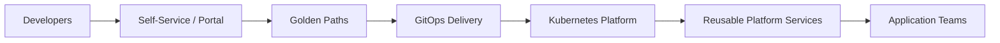

# Platform Engineering

## Focus Areas

- Internal Developer Platforms
- Platform as a Product
- Developer self-service
- Golden paths
- GitOps
- Helm and Kubernetes packaging
- Platform contracts
- Multi-cluster platform operations

## Platform Engineering Model

## Value Delivered

- Faster application onboarding
- Lower developer cognitive load
- Standardized application patterns
- Repeatable environments
- Clear platform ownership boundaries
