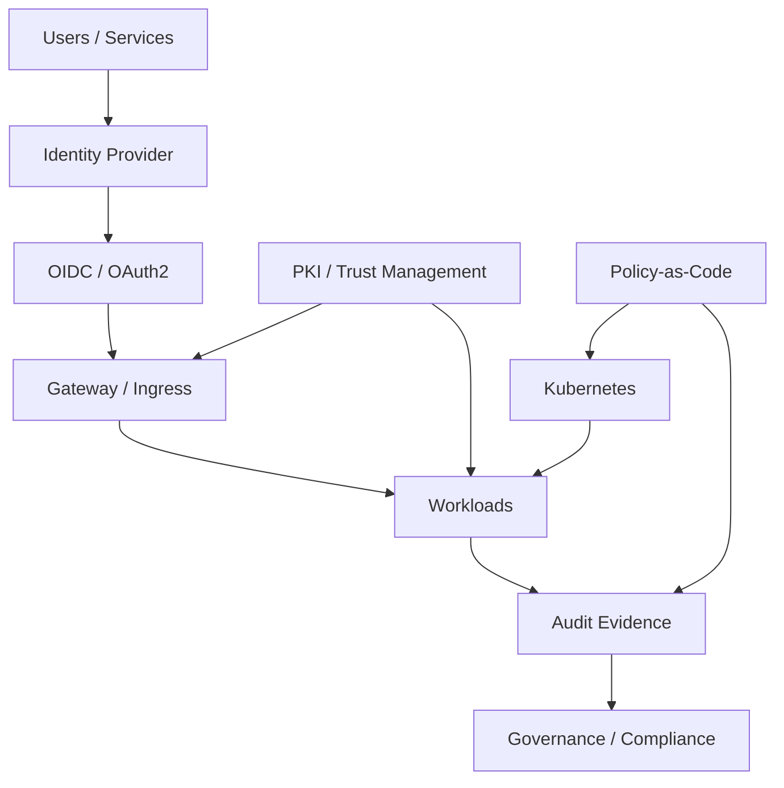

# Security & Identity Architecture

## Focus Areas

- OIDC and OAuth2
- Identity federation
- Keycloak-style identity integration
- PKI and certificate lifecycle
- Trust bundle distribution
- Policy-as-code
- Zero Trust principles
- NIST / FISMA-aware governance
- Secure software supply chain

## Reference Model

## Value Delivered

- Secure-by-default access model
- Consistent authentication and authorization
- Better audit readiness
- Reduced certificate and trust drift
- Stronger compliance posture
