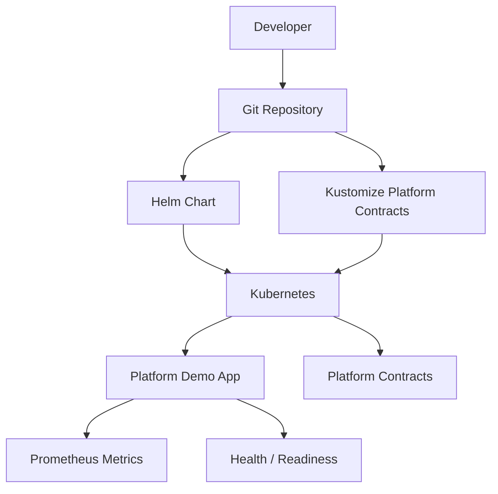

# Working Code Overview

This repo includes a small deployable application and Kubernetes platform contracts.

## What the Code Demonstrates

| Capability | Implementation |
|---|---|
| Application runtime | FastAPI service |
| Containerization | Dockerfile |
| Kubernetes packaging | Helm chart |
| Environment overlays | Kustomize |
| Platform contracts | ConfigMaps and Secrets |
| Observability | `/metrics` endpoint and scrape annotations |
| Health checks | `/health` and `/ready` |
| Security posture | non-root, read-only filesystem, dropped capabilities |
| Platform governance | namespace, quota, limit range |

## Architecture Pattern

